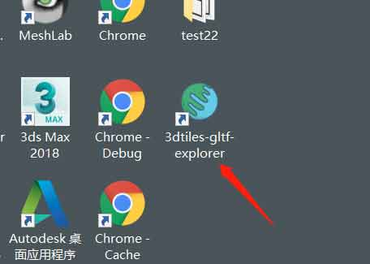
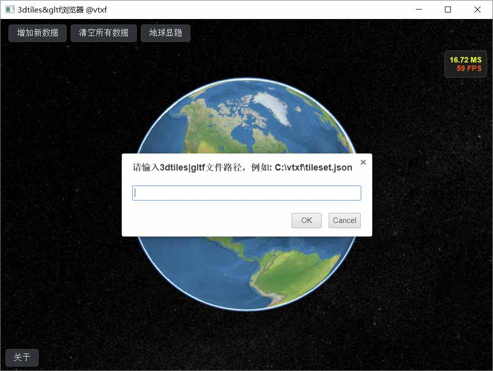
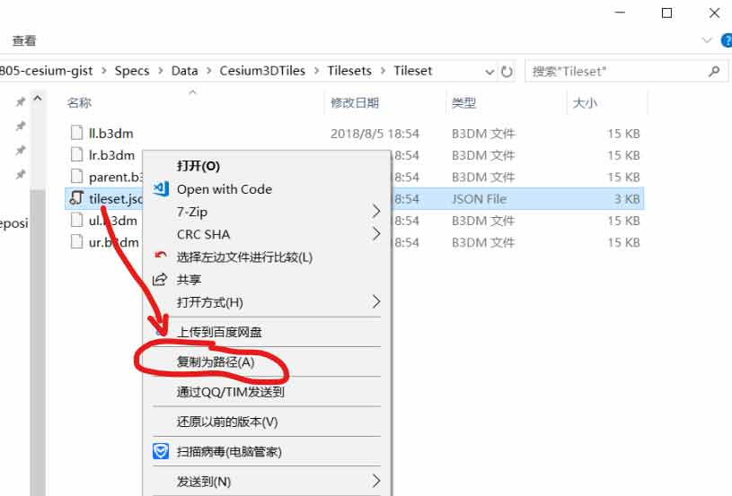
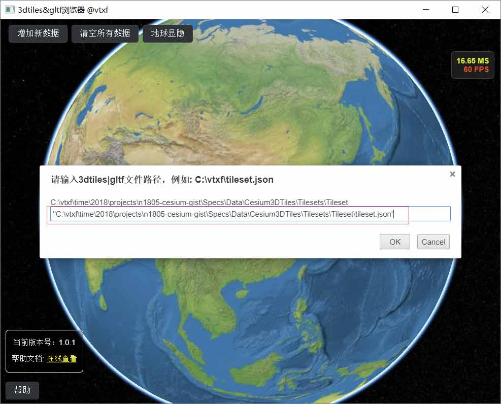
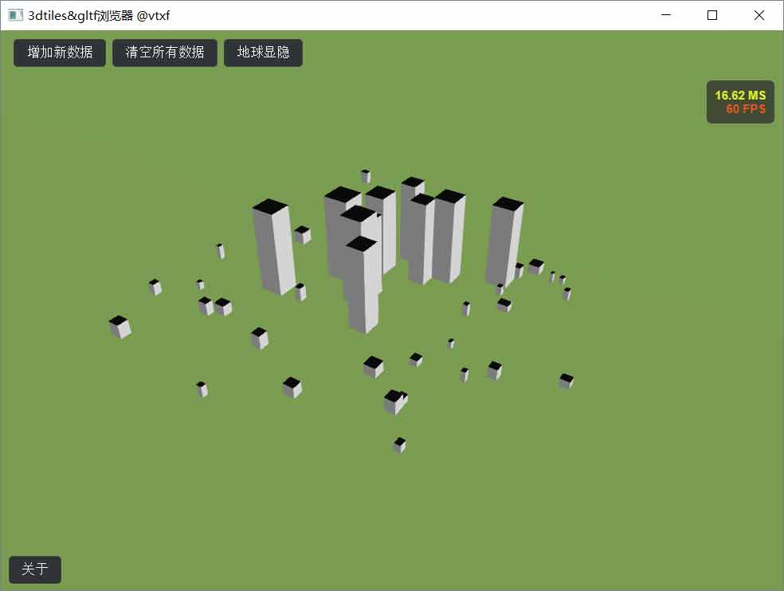

## 1 下载PC端程序
<a target="blank" href="https://pan.baidu.com/s/1Uat3DtH9cf79K4bLZGiZAA">百度网盘下载</a>&nbsp;
<a target="blank" href="https://download.csdn.net/download/xiaofeii/10585026">CSDN下载</a>  

## 2 安装之后，桌面上会出现相应的图标

## 3 双击打开程序

## 4 找到指定文件
在本地文件夹中找到相应的3dtiles数据。将光标移至在tileset.json文件上，按住shift键后点击鼠标右键。此时可以发现右键菜单中有一项"复制为路径"。 

再将复制好的路径粘贴到3dtiles浏览器的编辑框中。点击OK。  

## 5 打开文件后的效果

